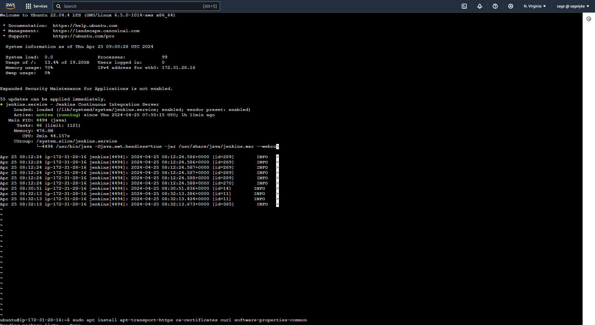
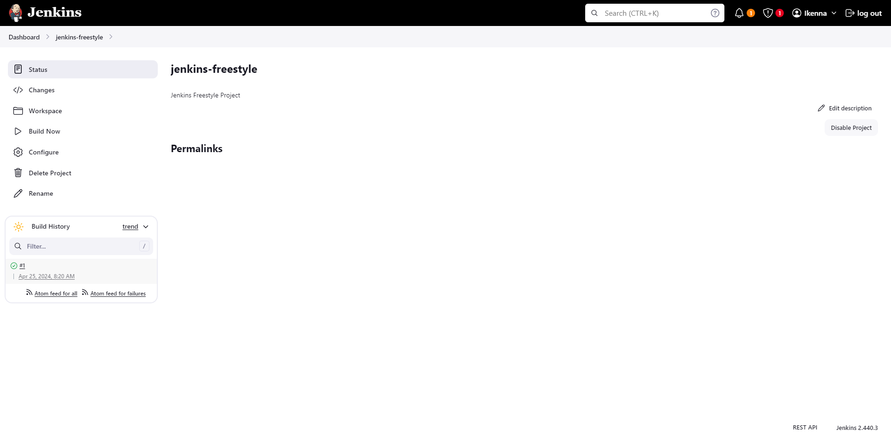
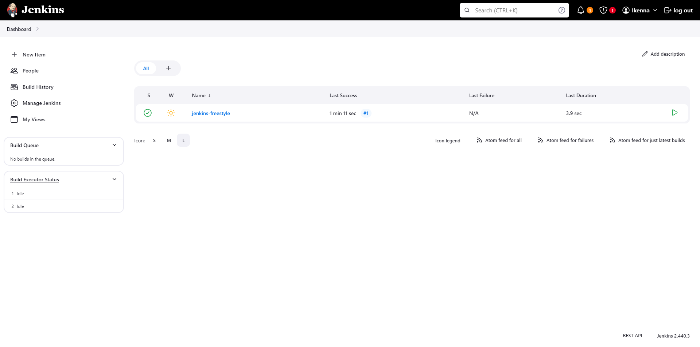
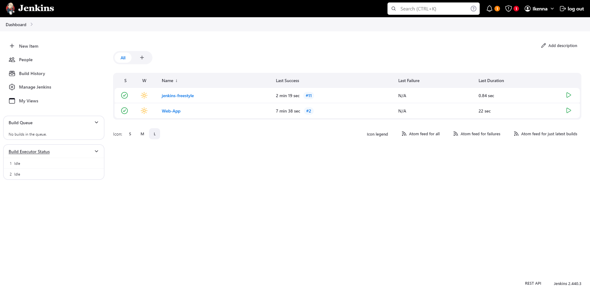

# Jenkins Exercise

> Create a Freestyle Jenkins Project
> Create a Jenkins Pipeline

## Step 1 - Create Virtual Machine (AWS)

- Log into your aws account with your credentials
  As a security measure, it is good practice to configure 2FA on your account to prevent unauthorized access.

- Search for EC2 and click on launch instance
- Fill the necessary details and click on create
- After creation, connect to your instance either locally or through the web console

## Step 2 - Install Jenkins

- Install jdk
```sudo apt install default-jdk-headless```

- Install and Connect to Jenkins
  It is good practice to create a user account on your virtual machine so you preserve the integrity of the root user.

  ```adduser <username>```
  - Provide your password and other optional info
  ```usermod -aG sudo <username>``` - This command adds the new user to the sudo group
  ```su <username>``` - switches account to the new user

``` shell
sudo wget -O /usr/share/keyrings/jenkins-keyring.asc \
  https://pkg.jenkins.io/debian-stable/jenkins.io-2023.key
echo "deb [signed-by=/usr/share/keyrings/jenkins-keyring.asc]" \
  https://pkg.jenkins.io/debian-stable binary/ | sudo tee \
  /etc/apt/sources.list.d/jenkins.list > /dev/null
sudo apt-get update
sudo apt-get install jenkins
```

- Ensure Jenkins is running using:
```sudo systemctl status jenkins```



- Update your security group on AWS to allow access to port 8080
- Visit the IP address on port 8080 and log in to the Jenkins Dashboard
- Install git, docker and other recommended plugins

- For security, I added a password to ensure that access to my pipeline is only accessible to authorized persons.

## Step 3 - Create Freestyle Project

- Click on new item, choose a name and select freestyle
- Configure jenkins and set build trigger to push from git
- Set webhook from github to jenkins url
- push to git repo to trigger build




## Step 4 - Create Pipeline Project

- Click on new item, choose a name and select pipeline
- Configure jenkins and set build trigger to push from git
- Create pipeline script
- Install Docker on the virtual machine
- Configure user access to Jenkins on Docker
- push to git repo to trigger build
- Create Dockerfile
- Create index file
- push changes to the repo to trigger build



