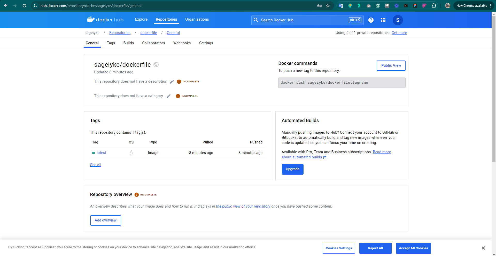

# Jenkins Exercise

> Create a Freestyle Jenkins Project
> Create a Jenkins Pipeline

## Create Virtual Machine (AWS)

- Log into your aws account with your credentials
  As a security measure, it is good practice to configure 2FA on your account to prevent unauthorized access.

- Search for EC2 and click on launch instance
- Fill the necessary details and click on create
- After creation, connect to your instance either locally or through the web console


## Install Jenkins

- Install and Connect to Jenkins
  It is good practice to create a user account on your virtual machine so you preserve the integrity of the root user.

  ```sudo adduser <username>```
  - Provide your password and other optional info
  ```usermod -aG sudo <username>``` - This command adds the new user to the sudo group
  ```su <username>``` - switches account to the new user

  

- Install jdk
```sudo apt install default-jdk-headless```

``` shell
sudo wget -O /usr/share/keyrings/jenkins-keyring.asc \
  https://pkg.jenkins.io/debian-stable/jenkins.io-2023.key
echo "deb [signed-by=/usr/share/keyrings/jenkins-keyring.asc]" \
  https://pkg.jenkins.io/debian-stable binary/ | sudo tee \
  /etc/apt/sources.list.d/jenkins.list > /dev/null
sudo apt-get update
sudo apt-get install jenkins
```

- Ensure Jenkins is running using:
```sudo systemctl status jenkins```


- Update your security group on AWS to allow access to port 8080


- Visit the IP address on port 8080 and log in to the Jenkins Dashboard


- Install git, docker and other recommended plugins


- For security, I added a password to ensure that access to my pipeline is only accessible to authorized persons.


## SCM Integration

- To integrate Jenkins to my Git, I had to create a project first, clicked on the configure option and configured Build Triggers to connect with GITScm polling.
- I then went to Github, under my repository settings to configure webhook to my Jenkins IP address.


```http://your-ip-address/github-webhook/```

- Set the content type to application/json. The default event is push.


## Create Freestyle Project


- Click on new item, choose a name and select freestyle


- Configure jenkins and set build trigger to push from git


- Since I already set the webhook, once I push to the repo, it'll trigger a build
- push to git repo to trigger build


## Install Docker on Server

``` bash
  sudo apt-get update -y
  sudo apt-get install ca-certificates curl gnupg
  sudo install -m 0755 -d /etc/apt/keyrings
  curl -fsSL https://download.docker.com/linux/ubuntu/gpg | sudo gpg --dearmor -o /etc/apt/keyrings/docker.gpg
  sudo chmod a+r /etc/apt/keyrings/docker.gpg

  # Add the repository to Apt sources:
  echo \
    "deb [arch=$(dpkg --print-architecture) signed-by=/etc/apt/keyrings/docker.gpg] https://download.docker.com/linux/ubuntu \
    $(. /etc/os-release && echo "$VERSION_CODENAME") stable" | \
    sudo tee /etc/apt/sources.list.d/docker.list > /dev/null
    sudo apt-get update -y
    sudo apt-get install docker-ce docker-ce-cli containerd.io docker-buildx-plugin docker-compose-plugin -y
    sudo systemctl status docker
```


- Add Jenkins to Docker sudo group
```usermod -aG sudo docker jenkins```

- Restart Jenkins
```sudo systemctl restart jenkins```

## Configure Docker on Jenkins

- Create a token on Dockerhub to protect your login credentials


- Create credentials on Jenkins


## Create Pipeline Project

- Click on new item, choose a name and select pipeline


- Configure jenkins and set build trigger to push from git


- Create pipeline script


- git push to your git repo to trigger build
- Create Dockerfile
- Create index file
- push changes to the repo to trigger build

## Docker Image Creation

- To create a Docker image using Jenkins, you must include your docker file in your repository. The dockerfile contains commands used in creating a docker image.
- Once your dockerfile is ready, you can run:

```docker image build -t <name of your dockerfile> .```

- Since the pipeline is going to run this automatically, you don't have to run the script manually.

```docker images ls``` - This woud list all built images on your server.

## Docker Container Run

- To run a container, you use the image alredy built or an existing one from Dockerhub.
- Run ```docker run -itd --name nginx -p 8081:80 dockerfile```
- itd means you want to run your container in interactive and detached mode. This allows you access to your terminal afterwards.
- -p referes to the port you want to serve your image from.
- --name is optional but it refers to the name of the container being run and,
- The last option is the name of the image.

## Docker Push

- To push an image to DockerHub, you need to have authenticated.
- You also need the registry url (private or public)
- Run ```docker push <your-account>/<imagename>``` - by default, the tag would be latest.





