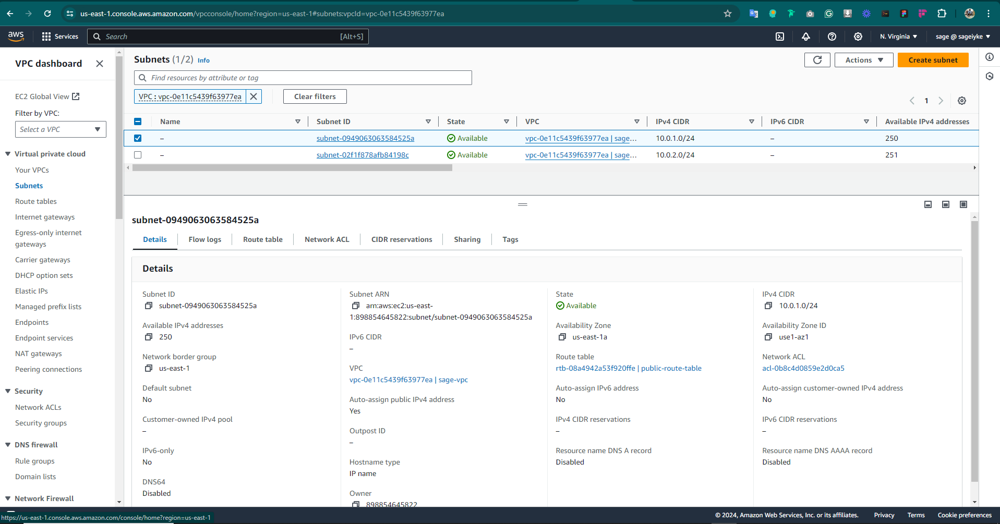

# Terraform Task

## Provision an AWS VPC using Terraform to create the following resources

- VPC
- Subnets (public and private)
- Internet Gateway
- Route Tables
- Security Groups
- Network ACLs (optional)

## Prerequisites

- AWS console account
- Terraform installed locally

## File Structure

- terraform-exercise
    -- provider.tf
    -- vpc.tf
    -- subnets.tf
    -- igw.tf
    -- nat.tf
    -- routes.tf
    -- security.tf
    -- acl.tf
    -- variables.tf
    -- terraform.tfvars

## Step 1: Change directory into the project directory and create your terraform files starting with the provider.tf file

``` hcl
    terraform {
        required_providers {
            aws = {
            source  = "hashicorp/aws"
            version = "5.49.0"
            }
        }
    }

    provider "aws" {
        region = var.region
    }
```

## Create the vpc.tf file

```hcl
    resource "aws_vpc" "sage-vpc" {
        cidr_block = var.cidr

        tags = {
            Name = "sage-vpc"
        }
    }
```

## Create your subnets.tf files

```hcl
    resource "aws_subnet" "sage-pub-subnets" {
        vpc_id                  = aws_vpc.sage-vpc.id
        cidr_block              = var.public_subnets.cidr_block
        availability_zone       = var.public_subnets.availability_zone
        map_public_ip_on_launch = var.public_subnets.map_public_ip_on_launch
    }

    resource "aws_subnet" "sage-priv-subnets" {
        vpc_id                  = aws_vpc.sage-vpc.id
        cidr_block              = var.private_subnets.cidr_block
        availability_zone       = var.private_subnets.availability_zone
        map_public_ip_on_launch = var.private_subnets.map_public_ip_on_launch
    }

```

## Create your internet gateway tf file

```hcl
    resource "aws_internet_gateway" "sage-igw" {
        vpc_id = aws_vpc.sage-vpc.id

        tags = {
            Name = "sage-igw"
        }
    }
```

## Create your public and private route tables and associate them with your subnets

```hcl
    resource "aws_route_table" "sage-pubrt" {
        vpc_id = aws_vpc.sage-vpc.id

        route {
            cidr_block = var.route_tables.cidr_block
            gateway_id = aws_internet_gateway.sage-igw.id
        }

        tags = {
            Name = "public-route-table"
        }
    }

    resource "aws_route_table" "sage-privrt" {
        vpc_id = aws_vpc.sage-vpc.id

        route {
            cidr_block = var.route_tables.cidr_block
            gateway_id = aws_nat_gateway.sage-nat.id
        }

        tags = {
            Name = "private-route-table"
        }
    }

    // Route Table Association Public
    resource "aws_route_table_association" "sage-pubrta" {
        subnet_id      = aws_subnet.sage-pub-subnets.id
        route_table_id = aws_route_table.sage-pubrt.id

        depends_on = [
            aws_subnet.sage-pub-subnets
        ]
    }

    // Route Table Association Private
    resource "aws_route_table_association" "sage-privrta" {
        subnet_id      = aws_subnet.sage-priv-subnets.id
        route_table_id = aws_route_table.sage-privrt.id

        depends_on = [
            aws_subnet.sage-priv-subnets
        ]
    }
```

## Create your security group allowing traffic into your subnets

```hcl
    resource "aws_security_group" "sage-sg" {
        name        = "sage-sg"
        description = "Allow TLS inbound traffic"
        vpc_id      = aws_vpc.sage-vpc.id

        ingress {
            description      = "SSH"
            from_port        = 22
            to_port          = 22
            protocol         = "tcp"
            cidr_blocks      = ["0.0.0.0/0"]
            ipv6_cidr_blocks = ["::/0"]
        }

        ingress {
            description      = "HTTP"
            from_port        = 80
            to_port          = 80
            protocol         = "tcp"
            cidr_blocks      = ["0.0.0.0/0"]
            ipv6_cidr_blocks = ["::/0"]
        }

        ingress {
            description      = "Jenkins"
            from_port        = 8080
            to_port          = 8080
            protocol         = "tcp"
            cidr_blocks      = ["0.0.0.0/0"]
            ipv6_cidr_blocks = ["::/0"]
        }

        ingress {
            description      = "HTTPS"
            from_port        = 443
            to_port          = 443
            protocol         = "tcp"
            cidr_blocks      = ["0.0.0.0/0"]
            ipv6_cidr_blocks = ["::/0"]
        }


        egress {
            from_port        = 0
            to_port          = 0
            protocol         = "-1"
            cidr_blocks      = ["0.0.0.0/0"]
            ipv6_cidr_blocks = ["::/0"]
        }

        tags = {
            Name = "sage-sg"
        }
    }
```

## Create Network ACLs for added security

```hcl
    resource "aws_network_acl" "pub_nacl" {
        vpc_id = aws_vpc.sage-vpc.id

        egress {
            protocol   = "tcp"
            rule_no    = 200
            action     = "allow"
            cidr_block = "0.0.0.0/0"
            from_port  = 443
            to_port    = 443
        }

        ingress {
            protocol   = "tcp"
            rule_no    = 100
            action     = "allow"
            cidr_block = "0.0.0.0/0"
            from_port  = 80
            to_port    = 80
        }

        ingress {
            protocol   = "tcp"
            rule_no    = 300
            action     = "allow"
            cidr_block = "0.0.0.0/0"
            from_port  = 22
            to_port    = 22
        }

        tags = {
            Name = "main"
        }
    }
```

## Create your variables.tf file

```hcl
    variable "region" {
        type = string
    }

    variable "cidr" {
        type        = string
        description = "The vpc"
    }

    variable "public_subnets" {
        type = object({
            cidr_block              = string
            availability_zone       = string
            map_public_ip_on_launch = bool
        })
        description = "The public subnets"
    }

    variable "private_subnets" {
        type = object({
            cidr_block              = string
            availability_zone       = string
            map_public_ip_on_launch = bool
        })
        description = "The private subnets"
    }

    variable "route_tables" {
        type        = map(string)
        description = "Route tables for subnets"
    }
```

## Step 2: Run terraform commands

- Run `terraform init` to initialize the folder

- Run `terraform validate` to ensure your configuration is valid

- Run `terraform fmt` to format your files

- Run `terraform plan` to view the creation plan terraform creates for your infrastructure


- Run `terraform apply` to apply the plan created in the previous command. Ensure you review and approve the command with the yes flag on prompt


## Step 3: Review the infrastructure from the AWS Console





## Step 4: Destroy Resources


